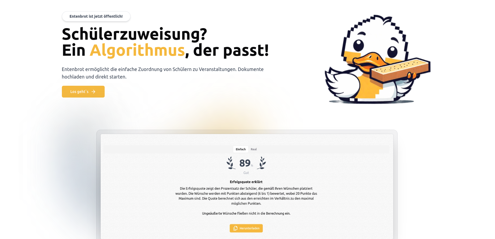

# Entenbrot

Entenbrot ermöglicht die einfache Zuordnung von Schülern zu Veranstaltungen. Dokumente hochladen und direkt starten.

Die Software anstand in Rahmen eines Schulprojekts.



## Entwickler

- [Justin J.](https://github.com/ZyklopRT)
- [Eric R.](https://github.com/superzig)
- [André F.](https://github.com/itsandremov)
- Tim

## Requirements

#### Backend

- PHP 8.1 oder höher
- ext-zip
- composer

#### Frontend

- node ^21.7.1
- npm ^10.2.3

## Installation
    
Dieses Projekt besteht aus zwei Hauptkomponenten: dem Backend, das mit Laravel entwickelt wurde, und dem Frontend, das mit Next.js erstellt wurde. Hier ist eine schrittweise Anleitung, um beide Teile des Projekts einzurichten und auszuführen.

## Backend-Einrichtung (Laravel)

Um das Laravel-Backend einzurichten, folgen Sie diesen Schritten:

1. Navigieren Sie in das Backend-Verzeichnis:

   ```bash
   cd backend
   ```

2. Installieren Sie die PHP-Abhängigkeiten mit Composer:

   ```bash
   composer install
   ```

3. Kopieren Sie die `.env.example`-Datei zu einer neuen `.env`-Datei:

   ```bash
   cp .env.example .env
   ```

4. Generieren Sie einen neuen Anwendungsschlüssel:

   ```bash
   php artisan key:generate
   ```

5. Starten Sie den Laravel-Entwicklungsserver:

   ```bash
   php artisan serve
   ```

   Ihr Backend sollte jetzt unter `http://localhost:8000` erreichbar sein.

## Frontend-Einrichtung (Next.js)

Um das Next.js-Frontend einzurichten und zu starten, befolgen Sie diese Schritte:

1. Navigieren Sie in das Frontend-Verzeichnis:

   ```bash
   cd frontend
   ```

2. Installieren Sie die Node.js-Abhängigkeiten:

   ```bash
   npm install
   ```

### Entwicklungsserver starten

Um den Next.js-Entwicklungsserver zu starten, führen Sie den folgenden Befehl aus:

```bash
npm run dev
```

Nach dem Start ist das Frontend standardmäßig unter `http://localhost:3000` verfügbar.

### Produktionsbuild und -start

Um das Frontend für die Produktion zu bauen und zu starten, führen Sie die folgenden Befehle aus:

1. Erstellen Sie den Produktionsbuild:

   ```bash
   npm run build
   ```

2. Starten Sie das Frontend im Produktionsmodus:

   ```bash
   npm start
   ```

> Für Image-Optimization kann das Package `sharp` verwendet werden. Dafür muss das Package installiert werden und die `sharp`-Option in der `next.config.js` aktiviert werden.
> `npm i sharp` und in der `next.config.js`: `images: { sharp: true }`

Nach diesen Schritten sollte Ihr Next.js-Frontend für die Produktion bereit sein und standardmäßig unter `http://localhost:3000` laufen, sofern Sie keinen anderen Port konfiguriert haben.

## Fertig!

Sie haben jetzt das Backend und Frontend erfolgreich eingerichtet. Für weitere Anweisungen, wie Sie die Anwendung verwenden oder erweitern können, lesen Sie die spezifische Dokumentation für das Backend oder Frontend.
